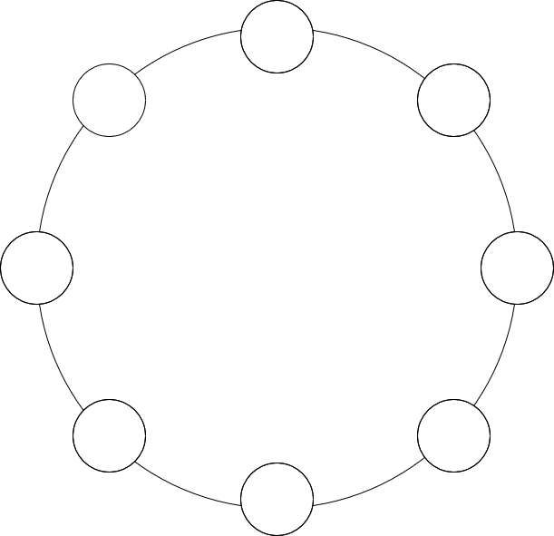

# KNAVE: 2-DOF Five Bar Haptic Device

<div align="center">
  
  
  **KNAVE** - A 2 Degrees of Freedom (DOF) Five Bar parallel manipulator providing haptic (force feedback) interaction for applications such as neuromotor rehabilitation.
  
  <br>
  <sub><em>📦 This is an archived version of the project - maintained for reference and historical purposes</em></sub>
</div>

---

## 📋 Project Overview

KNAVE is a sophisticated haptic device that achieves precise position and force control using real-time impedance and torque control algorithms. The device provides force feedback for applications in rehabilitation, research, and human-computer interaction.

> **⚠️ Archive Notice**: This repository contains an archived version of the KNAVE project. The code has been cleaned and organized for reference purposes, but is no longer actively maintained or developed. This version preserves the working implementation as it existed during the project's active development phase.

### Key Features
- **2-DOF Parallel Manipulator**: Five-bar linkage mechanism for precise motion
- **Real-time Control**: Impedance and torque control algorithms
- **Haptic Feedback**: Force feedback for user interaction
- **Modular Design**: Separate firmware and PC GUI components
- **Research Ready**: Suitable for rehabilitation and research applications

---

## 🏗️ System Architecture

```
┌─────────────────┐    Serial    ┌─────────────────┐
│   PC GUI        │◄────────────►│  Arduino Due    │
│  (C# .NET)      │              │  (SAM3X8E)      │
└─────────────────┘              └─────────────────┘
                                         │
                                         ▼
                              ┌─────────────────┐
                              │  Haptic Device  │
                              │  (Motors,       │
                              │   Encoders)     │
                              └─────────────────┘
```

---

## 📁 Repository Structure

```
KNAVE/
├── firmware/
│   └── Haptic_Control_CODEX.ino    # Main Arduino firmware
├── pc_gui/
│   └── WindowsFormsApp1/           # C# Windows Forms GUI
├── images/                         # Documentation images
│   ├── knav-logo.png
│   ├── device-diagram.png
│   └── gui-screenshot.png
└── README.md
```

---

## 🔧 Hardware Components

<div align="center">
  
</div>

### Core Components
- **Actuation**: DC motors with gearbox (Capstan Drive mechanism)
- **Sensing**: Rotary encoders (E50S) for position feedback
- **Controller**: SAM3X8E ARM Cortex 32-bit microcontroller
- **Motor Drivers**: H-Bridge modules (BTS7960B, IBT-2)
- **PWM Generation**: TL494 IC
- **Current Sensing**: Analog feedback and conditioning circuits

### System Parameters
- **Link Lengths**: Lc1=21.26mm, Lc2=29.21mm, Lc3=110mm, Lc4=110mm, L=220mm
- **Masses**: m1=256g, m2=294g, m3=66g, m4=86g
- **Inertias**: I1=1.017e-3, I2=1.987e-3, I3=2.12e-3, I4=5.772e-3 kg⋅m²

---

## 🧠 Control Algorithms

### Impedance Control
Implements dynamic force feedback based on user interaction and virtual environment modeling:
```
F = Kp(x - x₀) + Kd(v - v₀)
```

### Torque Control
Uses PID controllers, tuned for each motor, to regulate current and achieve desired torque.

### Dynamic Model
Real-time computation of robot dynamics for accurate control using the Lagrangian formulation.

### Closed-Loop Current Control
Ensures precise actuation using sensor feedback and PWM generation.

---

## 💻 Software Components

### 1. Embedded Firmware (`firmware/`)
- **Platform**: Arduino Due (SAM3X8E ARM Cortex MCU)
- **Main File**: `Haptic_Control_CODEX.ino`
- **Responsibilities**:
  - Read rotary encoders for joint positions
  - Compute kinematics and dynamics
  - Implement real-time control (impedance, torque, PID)
  - Generate PWM for motor drivers
  - Communicate with the PC GUI via serial

#### How to Use
1. Open `firmware/Haptic_Control_CODEX.ino` in the Arduino IDE
2. Select the Arduino Due board and correct port
3. Upload to the device

### 2. PC GUI (`pc_gui/WindowsFormsApp1/`)
- **Platform**: Windows (C# .NET Framework, Visual Studio)
- **Main Project**: `WindowsFormsApp1`
- **Responsibilities**:
  - Provide a graphical interface for device control and monitoring
  - Communicate with the embedded firmware via serial
  - Send commands, receive data, and visualize device state

<div align="center">
  
</div>

#### How to Use
1. Open `pc_gui/WindowsFormsApp1/WindowsFormsApp1.csproj` in Visual Studio
2. Build and run the project
3. Connect to the device via the appropriate COM port

---

## 🚀 Getting Started

### Prerequisites
- Arduino IDE with Arduino Due support
- Visual Studio (for PC GUI)
- .NET Framework 4.7.2 or later
- Serial communication capability

### Quick Start
1. **Upload Firmware**:
   ```bash
   # Open Arduino IDE
   # Load firmware/Haptic_Control_CODEX.ino
   # Select Arduino Due board
   # Upload to device
   ```

2. **Run PC GUI**:
   ```bash
   # Open Visual Studio
   # Load pc_gui/WindowsFormsApp1/WindowsFormsApp1.csproj
   # Build and run
   ```

3. **Connect Device**:
   - Connect Arduino Due via USB
   - Select correct COM port in GUI
   - Click "Start" to begin communication

---

## 📊 Communication Protocol

The system uses a simple serial protocol for communication:

### Commands (PC → Device)
- `ST0G` - Reset
- `ST1G` - Spring and Damper mode
- `ST2G` - Collision mode  
- `ST3G` - Rehabilitation mode
- `ST8G` - Start
- `ST9G` - Stop

### Data (Device → PC)
Format: `XAYBMC`
- `X` - X position
- `Y` - Y position  
- `M` - Mode/status

---

## 🔬 Applications

### Rehabilitation
- Neuromotor rehabilitation exercises
- Force feedback training
- Movement pattern analysis

### Research
- Human-computer interaction studies
- Haptic perception research
- Control algorithm development

### Education
- Robotics and control systems learning
- Haptic technology demonstration
- Mechatronics education

---

## 🛠️ Development

### Code Quality
- All legacy, duplicate, and test code has been removed for clarity
- Only the latest, working versions are retained
- Comprehensive documentation and comments added
- Professional code structure and naming conventions

### Archive Status
- **No Active Development**: This project is archived and not accepting new contributions
- **Reference Only**: Code is maintained for educational and reference purposes
- **Historical Preservation**: Represents the final working state of the project
- **Documentation**: Comprehensive documentation added for future reference

### For Historical Reference
This repository preserves the complete working implementation of the KNAVE haptic device project, including:
- Final firmware version with all optimizations
- Complete PC GUI with all features
- Full documentation and setup instructions
- System parameters and calibration data

---

## 📝 Notes

- PID parameters should be calibrated for optimal performance
- Hardware setup includes custom 3D-printed parts and PCBs
- The codebase covers embedded firmware, PC GUI, and communication protocols only
- For mechanical assembly and hardware design, refer to the project documentation

---

## 📄 License

[Add your license information here]

---

## 👥 Authors

- **Original Developer**: Anas Hawasli
- **Archive Maintainer**: Anas Hawasli
- **Email Adress**: hawasli.h.anas@gmail.com
- **Supervisro**: PhD Ahed Albadin (HIAST)
- **Last Cleaned**: July 2025
- **Archive Date**: July 2025

---

## 🙏 Acknowledgments

- Arduino Due platform
- SAM3X8E microcontroller
- C# .NET Framework
- Haptic technology community

---

<div align="center">
  <em>Built with ❤️ for haptic technology research and development</em>
  <br>
  <sub><em>📚 Archived for educational and reference purposes</em></sub>
</div>

